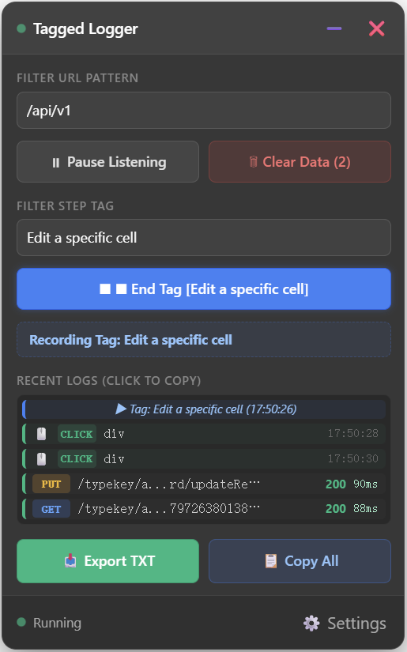
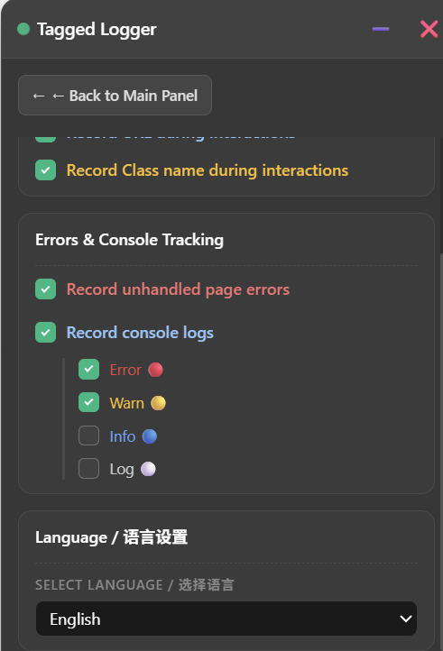
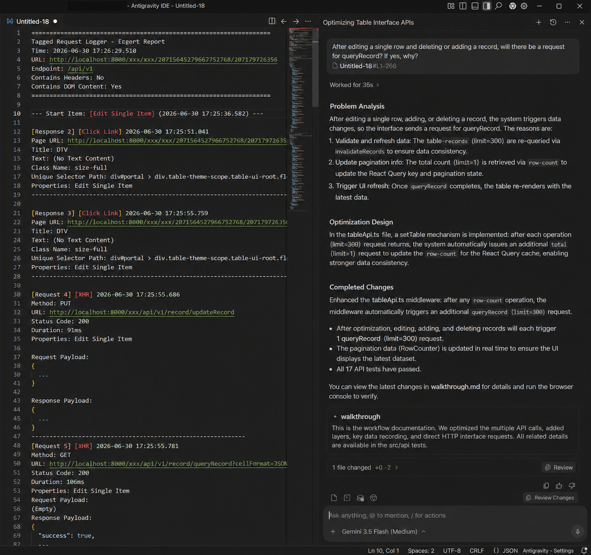
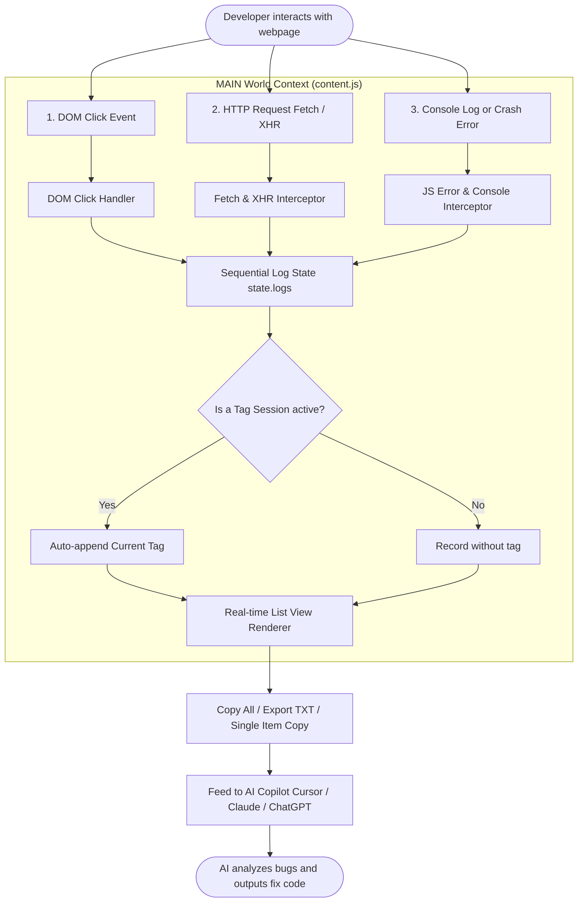

# Tagged Request Logger 📡

[](https://developer.chrome.com/docs/extensions/mv3/intro/)
[](LICENSE)
[]()

`Tagged Request Logger` is a high-fidelity debugging and context capture tool for browsers, specifically designed for the **AI-Assisted Development** era. By intercepting runtime HTTP requests, DOM click interactions, console logs, and global unhandled exceptions, it generates highly structured, sequential timeline reports. You can copy and paste this context directly into AI tools to locate bugs and iterate features at blazing speeds.

[中文版说明文档](./README.zh-CN.md)

---

## 📸 Screenshots (English Version)

To help you get familiar with the tool quickly, here are the core interface previews and workflow descriptions:

#### 1. Main Operation Panel
<p align="left">
  
</p>
*The main operation panel docked in the bottom-right corner of a webpage, displaying a real-time sequential log of DOM clicks, intercepted HTTP requests, and JS exceptions. You can tag your steps and export all actions.*

#### 2. Advanced Configuration Settings
<p align="left">
  
</p>
*By clicking the gear icon in the footer, you can slide into the settings page to configure HTTP header whitelists/blacklists, toggle DOM click attributes, select console levels (Error, Warn, Info, Log), and switch UI languages.*

#### 3. AI Copilot Diagnosis Demo
<p align="left">
  
</p>
*A typical debugging workflow: copy the sequential text output from the panel and paste it directly into Cursor, Claude, or ChatGPT. The AI will immediately analyze the context and pinpoint the bug.*

---

## 💡 Why Tagged Request Logger?

In AI-assisted coding, developers face a **"Context Gap"**: when asking an AI to fix a bug, they have to manually capture Console logs, copy Network payloads, take screenshots, and type instructions about what button was clicked. This is tedious, slow, and prone to losing critical context.

### Core Comparison

| Dimension | Standard F12 Developer Tools | Tagged Request Logger |
| :--- | :--- | :--- |
| **Timeline Integration** | Console, Network, and Element inspector live in separate tabs, completely fragmented. | All clicks, HTTP requests, errors, and console messages are nested in a single unified timeline. |
| **Session Isolation (Tag)** | Hard to isolate logs generated from a specific user interaction sequence. | Provides a "Start Tag" mechanism to group logs triggered by a particular flow. |
| **Data Privacy (Masking)** | Copied data often contains sensitive Auth Tokens or passwords. | Built-in client-side data masking. Sensitive fields are replaced with `******` before storing. |
| **AI Compatibility** | Log exports have heavy noise (CSS, images, tracking scripts) consuming too many tokens. | Focuses on core API patterns (regex-supported) and user actions. Clean, minimal, ready for LLMs. |

---

## 🌀 How it Works

The extension runs in the **MAIN world** context of the tab, bypassing content script sandbox limits. It overrides API prototypes and registers global error handlers cleanly:



---

## ✨ Features

*   **📡 Invisible HTTP Interception**: Hooks into global `window.fetch` and `XMLHttpRequest` automatically.
*   **🏷️ Micro-Session Tagging**: Enter a task name (e.g., `Submit form failed`) and click `⏺ Start Tag`. All subsequent clicks, requests, and logs will be isolated under this tag.
*   **🚫 Crash Exception Catching**: Global error handler captures JavaScript runtime errors (`window.onerror`) and unhandled promise rejections, parsing complete stack traces.
*   **🔴 Custom Console Logs**: Intercepts `console.log`, `info`, `warn`, and `error`. You can configure which levels to record (e.g., Error and Warn only) to prevent log noise.
*   **鼠标 点击 DOM Tracking**: Captures exact DOM paths (CSS Selectors with index calculation like `nth-of-type`) and element texts to guide the AI precisely.
*   **🔒 Local Masking & Privacy**: Automatically detects and replaces sensitive headers/body fields containing `token`, `password`, `secret`, `auth` with `******` on the client side.
*   **🗑️ Hover Quick Actions**: Hover over any preview log card to **📋 Copy Detail** or **🗑️ Delete Item** instantly.

---

## 🛠️ Installation

This extension is built with Manifest V3.

1. Clone or download this repository locally:
   ```bash
   git clone https://github.com/FQFangQi/tagged-request-logger.git
   ```
2. Open your Chromium-based browser (Chrome, Edge, Brave, etc.) and navigate to the Extensions page (`chrome://extensions/` or `edge://extensions/`).
3. Enable **"Developer mode"** in the top right corner.
4. Click **"Load unpacked"** in the top left.
5. Select the repository root folder.

---

## 🚀 Recommended Workflow (Debugging with AI)

When developing locally and hitting an issue:

1. **Describe the action**: In the **Tagged Logger** panel, type in the action name (e.g., `Form validation error`).
2. **Start recording**: Click `⏺ Start Tag`. The indicator light will start breathing.
3. **Reproduce the bug**: Interact with the page as a user.
4. **Grab the timeline**: Click `📥 Export TXT` or `📋 Copy All`.
5. **Feed it to AI**: Open your AI assistant (e.g., Cursor, Claude, ChatGPT) and paste the logs using the template below.

### 💬 Recommended Prompt Template
```markdown
I encountered a bug while developing locally. Here are the sequential logs, user clicks, and network outputs captured by Tagged Logger.
Please analyze the chronological sequence, HTTP payloads, responses, and stack traces, and output a fix for this bug.

[Paste your exported logs here]
```

---

## ⚙️ Advanced Configuration

Click `⚙️ Settings` at the bottom right to configure advanced options:

*   **URL Filtering**: Enter target substrings or a regular expression (e.g., `/api\/v1\//i`) to filter HTTP requests.
*   **Headers Debugging**:
    *   **Whitelist**: Only keep selected headers for AI logs.
    *   **Blacklist**: Exclude specific headers (default excludes `cookie`, `authorization`, `token`).
*   **DOM Clicks Extra Data**: Choose whether to append element class names and page URLs to click events.
*   **Error & Console Trackers**:
    *   Toggle global error listener.
    *   Select console logging levels (Error 🔴, Warn 🟡, Info 🔵, Log ⚪).
*   **Language Setting**: Hot-switch the panel language between English and Chinese (Simplified). The selected setting is instantly persisted and applied without page reload.
*   **GitHub Redirection**: Click the GitHub button at the top of settings to easily navigate back to this repository for feedback or updates.
*   **Workflow Guide (Timeline)**: A beautiful step-by-step CSS-based vertical timeline built right into the Settings panel for quick start guidance.
*   **Update Check & Manual Sync**: An interactive version checking block. It fetches the latest package version directly from GitHub raw files, handles browser CORS/CSP security restrictions gracefully, and provides a one-click download for manual updates.

---

## 📂 Project Structure
```
tagged-request-logger/
├── manifest.json       # Extension Manifest V3 file
├── content.js          # Injected MAIN world bundle containing i18n logic, styles, and UI
├── icon.png            # Extension Icon (128x128)
└── README.md           # Default English Documentation
```

---

## 📄 License

This project is licensed under the [MIT License](LICENSE).
